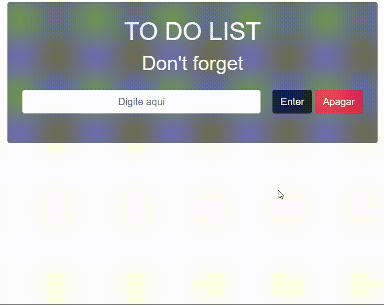

<h2> To-do List !</h2>

<h3>Hello guys</h3>

 A javascrip CRUD with localhost save items

A little bit of Bootstrap for a clean layout

 

<ul>
  <li> Create to-do for your day</li>
  <li> You can edit your activities</li>
  <li> Mark as "done" after complete then</li>
  <li> Delete one or all</li>
</ul>

 

Project create for study

